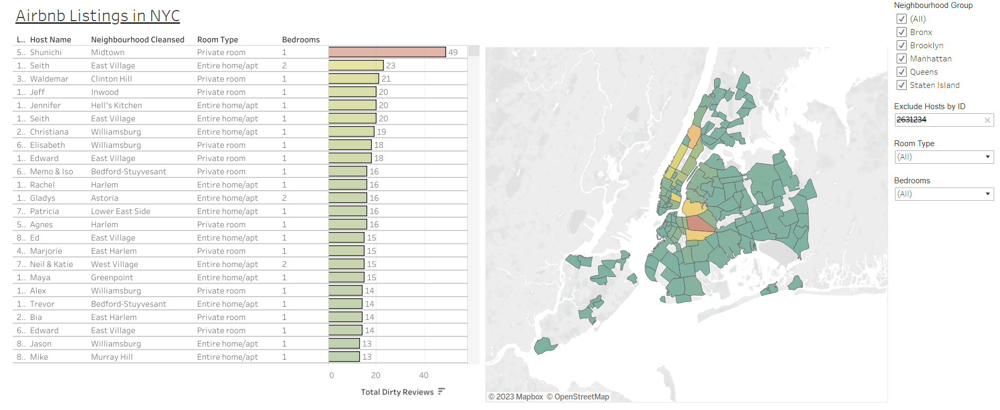

Airbnb Analysis for Cleaning Services"/>

<h1>Airbnb Analysis for Cleaning Services in NYC - Active Directory </h1>
<h2>Key Findings</h2>
 - 10% of Airbnb hosts have at least 4 dirty reviews per listing. The top 1% of Airbnb hosts have at least 12.84 dirty reviews per listing.
   
   
 - The Average Airbnb host has 1.9 dirty reviews per listing.
   
   
 - The top 25 Airbnb hosts have between 9 and 43 dirty reviews per listing.

<h2>Authors</h2>

<a href="https://github.com/Riley-livingston"> @RileyLivingston</a>

<h2>Description</h2>
This project consists of exploritory analysis of publicly available Airbnb data. This directory will guide you through the steps I took and thought process in formulating a client list for an Airbnb cleaning service in New York City.

 

<h2>Languages and Utilities Used</h2>

- SQL
- Tableau

<h2>Environments Used </h2>

- DBeaver 22.2.2

<h2>Data Source</h2>

- <a href="https://drive.google.com/drive/folders/1Q2yFaDajfJ6hALKMCmrQbHnFhsti44bO?usp=sharing"> Airbnb detailed listings and reviews data NYC 09-07-2022</a>
- <a href="https://docs.google.com/spreadsheets/d/1iWCNJcSutYqpULSQHlNyGInUvHg2BoUGoNRIGa6Szc4/edit#gid=1322284596"> Data dictionary</a>

<h2>Methods</h2>

- Exploratory data analysis

<h2>Data Analysis Process</h2>

 <u>Business Task</u>:
 
- Determine a high conversion rate client list that can be utulized by airbnb cleaning services in NYC using exploratory analysis.
 
  - KEY METRICS
    - number of distinct reviews that contain words signaling uncleanliness grouped by listing
 
 

 <u>Data preparation</u>: 
 
  PRIVACY AND ACESSABILITY
 
   - Data for this analysis was scrapped directly from Airbnb's website by third party <a href="https://insideairbnb.com"> insideairbnb</a>.
   - All data present in this repository as well as findings derived from analysis is publicly available information and falls under fair use. No private         information is being used including names, listings, and review details as it is all publicly displayed on Airbnb’s website.
   
  
  DATA STRUCTURE AND INTEGRITY
 
   - Data used in this analysis is organized in 2 tables (listings and reviews) and columns in csv format. 
   - Integrity of the data source was verfified by choosing 10 random listings urls from the listings table listing_url column and comparing the information from the link to the data scraped and organized into columns in the reviews and listings tables.

 
 
 
<u>Documentation of Data Processing and Cleaning</u>:  
  - <a href="https://github.com/Riley-livingston/AirBnb-Project/blob/main/clean_and_filtered_airbnb_mysql_script_v1.sql"> SQL script to clean and filter the data.sql</a>
  
  - <a href="https://github.com/Riley-livingston/AirBnb-Project/blob/main/clean_and_filtered_airbnb_data_v2.csv"> Cleaned and filtered data.csv</a>
  
  
SQL select statement with explaination"/>
<ul>
   <li> From the listings table, host_id, host_name, and host_url are selected. host_url and host_id are used as primary keys for the listings table to unqiuely identify each host.</li>
   <li> Host_total_listing count and number_of_reviews are selected and casted as integers. This turns all non-numerical data in both of those columns into NULL. The data is also tranformed to be used with operators and aggregations if needed.</li>
   <li> Distinct comments are counted, selected from the reviews table, and aggregated into a new column called dirty_review_count that will count all distinct reviews that contain specified 'dirty review' words.</li>
   </ul>
  
  
SQL Join statement and conditions for dirty reviews with explaination"/>
<ul>
   <li>  An inner join is made between the listings and reviews tables, returning columns where the listing id matches the id field from the review table AND where airbnb listing reviews in the comments column of the review table contain at least one of the specified dirty words contained in the LIKE statements.</li> 
   </ul>
  
  
SQL more filtering and group by order by conditions with explaination"/>
<ul>
    <li> The inner join between the lstings and reviews tables are further filtered under the condtions that the length of the review_score_rating and review_score_cleanliness ratings are no greater than 4 characters in length.</li>
    <li> The maximum number of reviews of any given listing is 999 so the maximum length of the number_of_reviews column was set to 3 in order to filter out potential invalid data.</li>
    <li> The query is fianlly grouped by host_id and host_url and then ordered by the total number of dirty reviews counted in descending order as a way to gain immediate insight into potential customers to contact for cleaning services.</li>
    </ul>
   
   
   
<u>Analysis</u>:  
   
   
  <ul>
 <li> In Tableau, dirty reviews per listing were calcualted for each host and the results were sorted in descending order. </li>
 <li> constructed a dual axis barchart showing the top 25 hosts in the NYC's 5 boroughs sorted by dirty reviews per listing and total dirty reviews. In the tooltip, I embeded the link to the hosts unique Airbnb Url so that if the dashboards are used as a potential client list, contact information will be easily acessable. </li>
 <li> Accross all hosts, median, 90th, and 99th perentiles for dirty reviews per listing were calculated. </li>
 <li> I included a <a href="https://public.tableau.com/app/profile/riley.livingston/viz/Airbnbdirtyreviewproject/Dashboard2?publish=yes"> dynamic histogram </a> that can be used as a filter for targeting hosts in a specific dirty review per listing bin. To use this, click on a bin and the packed bubble diagram will filter results to only include hosts from the bin you selected. </li>
 </ul>

  
  
 <u>Key Findings</u>:
   
   
  <ul>
  <li>  10% of Airbnb hosts have at least 4 dirty reviews per listing. The top 1% of Airbnb hosts have at least 12.84 dirty reviews per listing.</li>
  <li> The Average Airbnb host has 1.9 dirty reviews per listing. </li> 
  <li> The top 25 Airbnb hosts have between 9 and 43 dirty reviews per listing. </li>
  </ul>

 
  
 <h2> Client Dashboard Preview </h2>
 
 <a href="https://public.tableau.com/views/AirbnbforCleaningServices/AirbnbClientDashboard?:language=en-US&:display_count=n&:origin=viz_share_link"> Client Dashboard</a>
 
 
 
<h2>Limitations and What Can be Improved </h2>
 Limitations:
 
 
<ul>
  <li> The data and results of the analysis are a snapshot of listings available from Airbnb on and before September 7th 2022. Hosts may remove or add listings at anytime and renters may post or delete reviews at anytime which may impact the results of the analysis. Seasonality bias may be present in the number of reviews that contain 'dirty' words indicating uncleanliness.</li>
 
 <li> The words used to measure dirty reviews are all weighted the same but each dirty review may differ in the severity of the uncleanliness which would impact bookings and be of greater interest to a cleaning service looking for clients.</li>
 
   <li> A list of 15 words was selected to search for dirty reviews in the communts column of the reviews table. This list may not represnted all of the ways a person would describe uncleanliness and lead to some reviews not being included in the analysis. </li>
   </ul>
 
 
 Future Improvements:
 
 
<ul>
  <li> Multivariate linear regression looking at the relationship between number of dirty reviews a particular listing has and the average number of days booked out of 30 would be of use to cleaning services. The relatinship between those 2 variables generated could help bsuinesses show the value of using a cleaning service to potential cleints.</li>
 
  <li> A live dashboard could greatly improve this project by providing cleaning services data about dirty reviews left on airbnb listings in real time. With this ability, cleaning services would gain a competitive advanatge in the airbnb cleaning service space by being able to contact disguruntled hosts shortly after receiving a negative review about the cleanliness of their listings.</li>
   
 <li> Use a machine learning model to classify dirty vs non-dirty reviews.</li>
 </ul>
